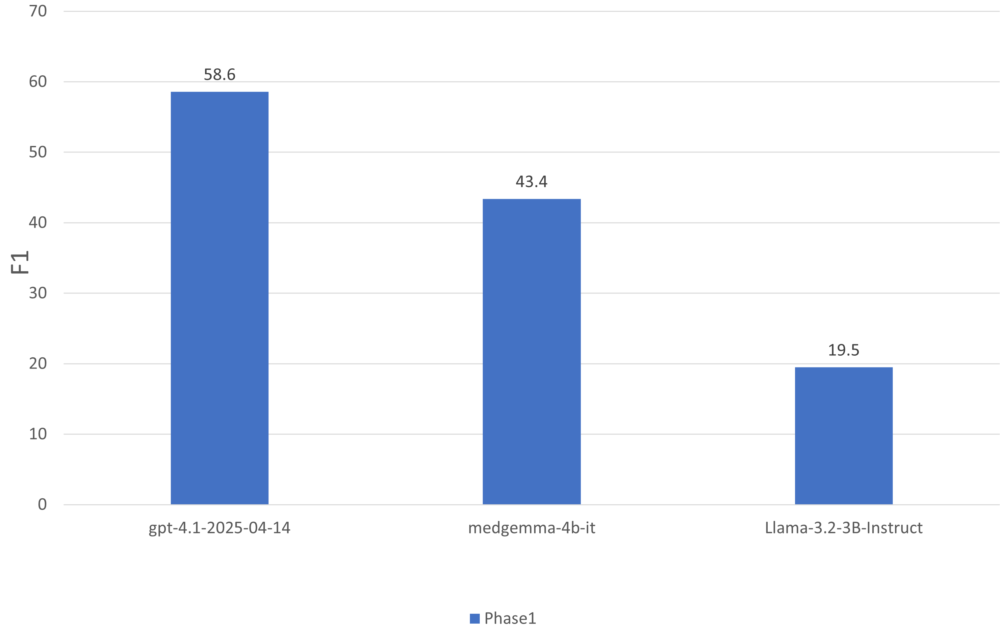
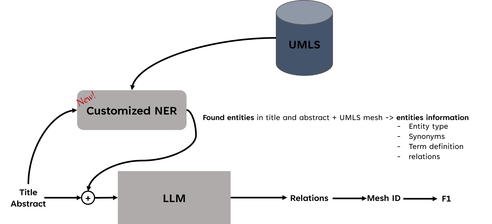
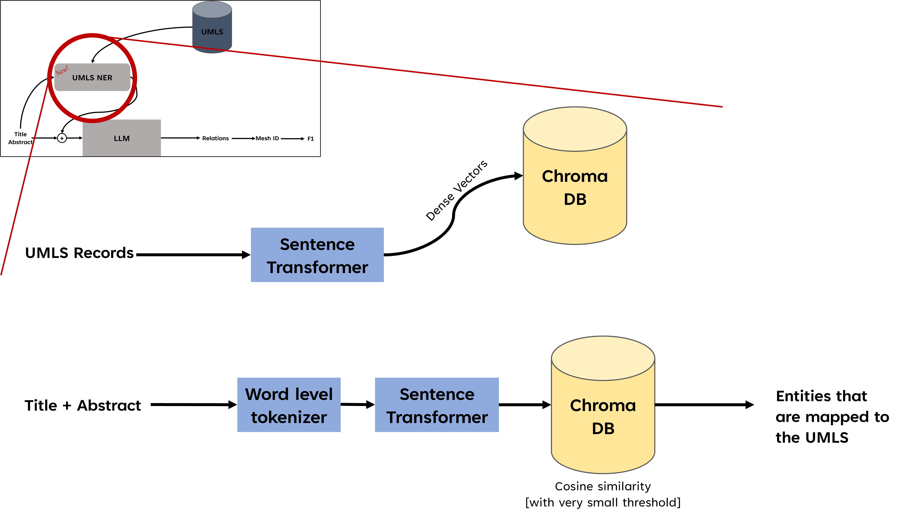
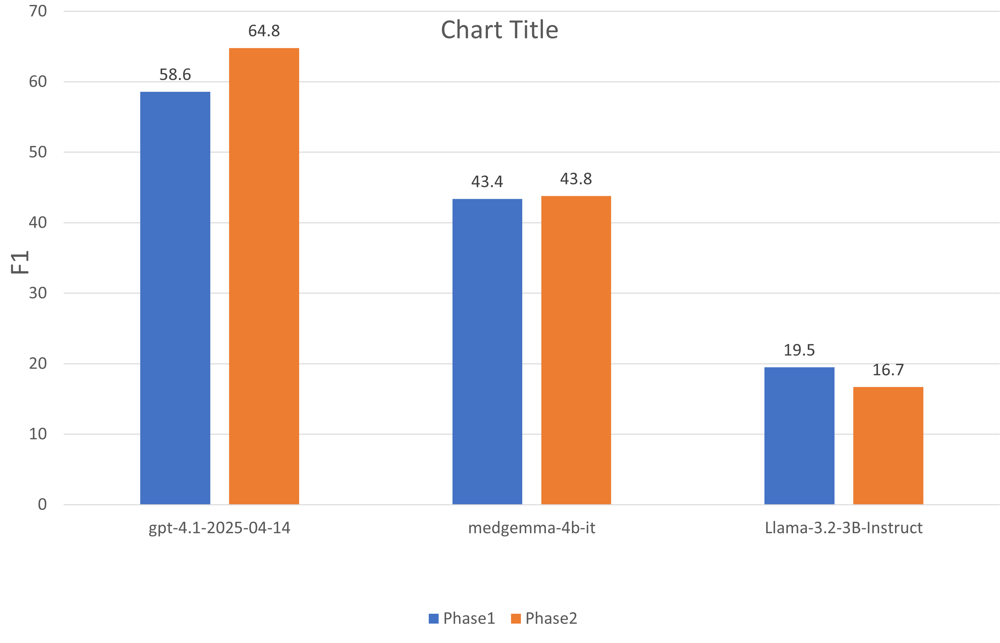
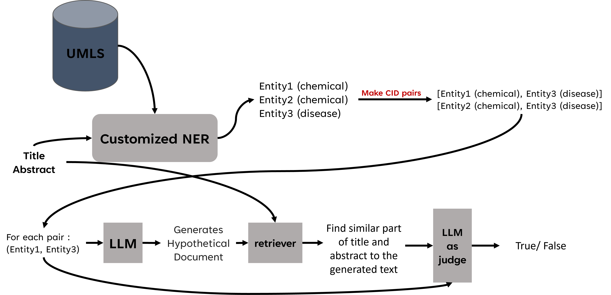
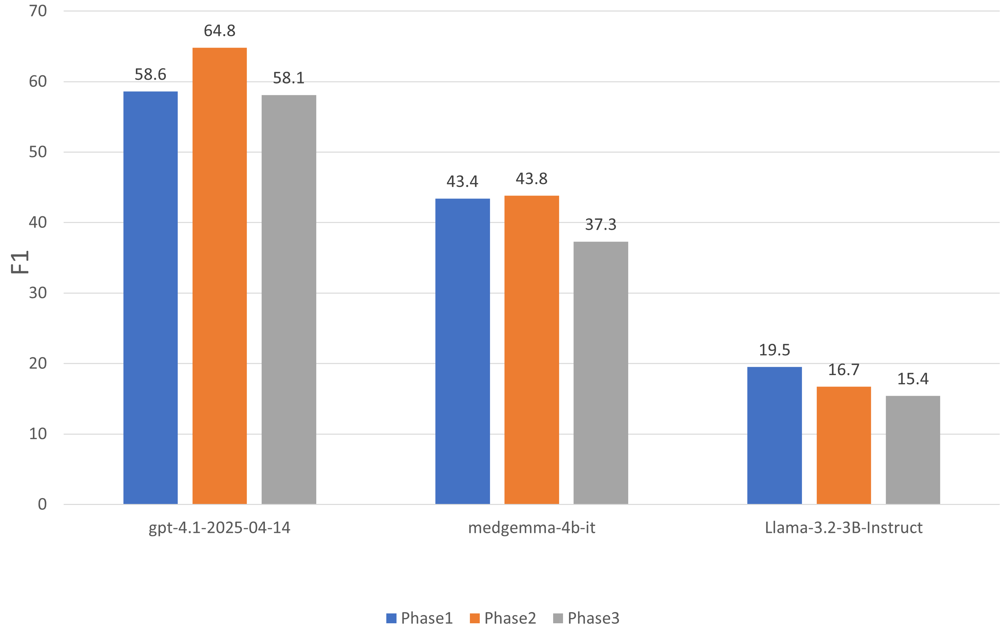

# Relation Extraction using RAG  

## 📌 Overview  
This project focuses on **relation extraction** in biomedical text using the **BC5CDR dataset**.  
We experiment with **prompt-based** and **retrieval-augmented** approaches, leveraging multiple **large language models (LLMs)** and a **sentence transformer**.  

The project explores how incorporating **UMLS knowledge** and **hypothetical document embeddings (HYDE)** affects relation extraction performance.  

---

## 🧠 Models Used  

- **LLMs**
  - [Meta-Llama/Llama-3.2-3B-Instruct](https://huggingface.co/meta-llama/Llama-3.2-3B-Instruct)  
  - [Google/MedGemma-4B-IT](https://huggingface.co/google/medgemma-4b-it)  
  - [OpenAI GPT-4.1 (2025-04-14)](https://platform.openai.com)  

- **Sentence Transformer**  
  - [cambridgeltl/SapBERT-from-PubMedBERT-fulltext](https://huggingface.co/cambridgeltl/SapBERT-from-PubMedBERT-fulltext)  

- **Dataset**  
  - BC5CDR 

---

## ⚙️ Approaches  

### 1. Prompt Engineering (Baseline)  
- Input: raw BC5CDR title and abstracts.  
- Direct LLM prompting for relation extraction.  
- **Performance**:  
  - GPT: **58.6 F1**  
  - MedGemma: **43.4 F1**  
  - LLaMA: **19.5 F1**  

---

### 2. UMLS + New NER Method  

Diagram for NER model:

- Developed a **custom NER model** with:  
  - **77% F1** in entity recognition.  
  - **Entity-to-UMLS mapping** for additional metadata:  
    - Term types, definitions, synonyms, relations.  
- Input: BC5CDR title + abstract → mapped to UMLS concepts.  
- This enriched context was provided to LLMs for relation extraction.  

- **Performance**:  
  - GPT: **↑ 58.6 → 64.8 F1**  
  - MedGemma: **↑ 43.4 → 43.8 F1**  
  - LLaMA: **↓ 19.5 → 16.7 F1**  

---

### 3. HYDE-based Approach  

- Steps:  
  1. Use NER to extract entities (Chemical–Disease pairs).  
  2. For each pair, generate a **hypothetical sentence** using LLM.  
  3. Compare generated sentence with original text sentences using **cosine similarity (SapBERT embeddings)**.  
  4. Select most relevant sentence.  
  5. Provide the retrieved sentence + entity pair to an LLM judge for relation classification.  

- **Performance**:  
  - No significant improvement over baseline.  
  - But **much more cost-efficient** than prompt engineering:  
    - Uses **only one sentence** per evaluation instead of full abstract.  
    - Reduces input/output token usage drastically.  

---

## 📊 Results Summary  

| Approach              | GPT F1 | MedGemma F1 | LLaMA F1 |
|-----------------------|--------|-------------|----------|
| Prompt Engineering    | 58.6   | 43.4        | 19.5     |
| UMLS + New NER        | 64.8   | 43.8        | 16.7     |
| HYDE                  | 58.1   | 37.3        | ~15.5    |

---

## 🚀 Key Takeaways  
- **UMLS enrichment significantly boosts GPT performance** (+6.2 F1).  
- **MedGemma shows marginal improvements**, while **LLaMA performance decreases** under enriched input.  
- **HYDE is cost-efficient** but doesn’t improve accuracy compared to direct prompting.  
- **Entity-to-UMLS mapping is a promising direction** for biomedical relation extraction.  